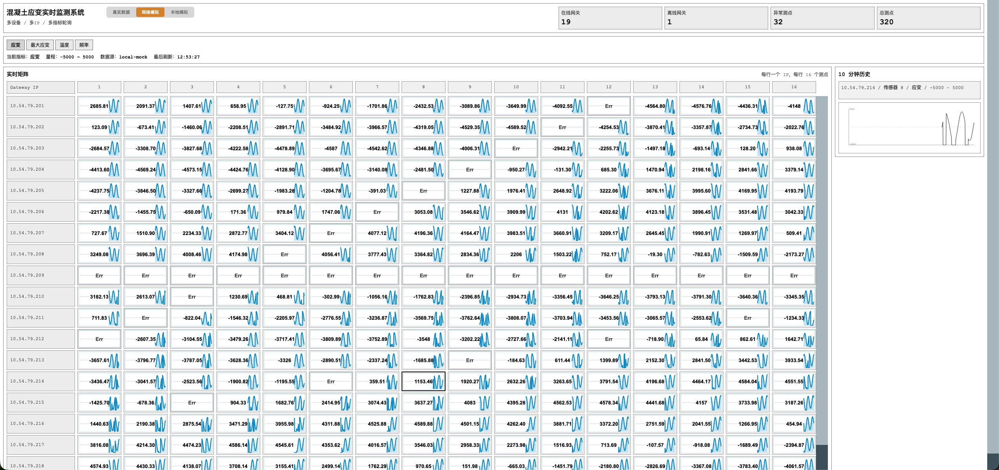

# RS485 Modbus Concrete Sensor Monitor

A real-time concrete sensor monitoring system built with Python, Django, and Django Ninja.

The project provides an industrial-style WebUI for RS485 Modbus concrete sensor networks, with a dense sensor matrix, metric tabs, short-term trend charts, and switchable data sources for real devices, Redis-backed simulation, and local mock data.

## Platform Demo

The current WebUI demo uses mock data. It is intended to show the monitoring platform layout, sensor matrix, trend panel, summary counters, and data-source switching behavior before the real RS485 gateways are connected.



## Scalability

The system is designed for large-scale concrete sensor deployments and can be extended toward million-sensor monitoring by adding Modbus gateways, collector workers, Redis capacity, and application instances.

In practice, the upper bound is mainly constrained by field-network congestion and link quality. Gateway bandwidth, sampling frequency, packet loss, Redis write throughput, and dashboard query load should be planned together for production deployments.

## Current Status

Completed:

- Django project structure and Django Ninja API.
- Industrial monitoring dashboard with a high-density matrix, metric tabs, and 10-minute history trends.
- Three data-source modes: real data, network simulation, and local mock data.
- Redis data path with isolated namespaces for real and simulated data.
- Modbus TCP collector under `collector/`, including FC03 reads and Redis writes.
- Network simulation via `test/mock_server.py --feed`.
- Local mock fallback when Redis is unavailable.
- Standalone test prototype and load-test scripts under `test/`.

Pending:

- Hardware integration with real Modbus TCP gateways.
- Long-term historical persistence.
- Alarm and notification module.

## Data Flow

```text
Real data:
  RS485 sensors -> python collector/main.py
      -> Modbus TCP FC03 parsing -> RedisWriter
  Redis:6379 monitor:sensor:{ip}:{sensor_index} TTL=10s
      -> Django RedisReader
  WebUI

Network simulation:
  python test/mock_server.py --feed
      -> 320 simulated keys per second (20 gateways x 16 sensors)
  Redis:6379 monitor:test:{ip}:{sensor_index} TTL=10s
      -> Django RedisReader
  WebUI

Local mock:
  Django LocalMockProvider
      -> in-process generated snapshots
  WebUI
```

The three namespaces are isolated, so switching a data source in the UI does not affect the other modes.

## Project Structure

```text
RS485-Modbus-Concrete-Sensor-Monitor/
├── manage.py
├── requirements.txt
├── config/              Django project configuration
├── app/
│   ├── templates/       WebUI templates
│   ├── static/          CSS and JavaScript assets
│   ├── services/
│   │   ├── redis_reader.py
│   │   ├── local_mock.py
│   │   └── dashboard_service.py
│   ├── api.py
│   └── views.py
├── collector/           Modbus TCP collector
│   ├── main.py
│   ├── modbus_client.py
│   ├── redis_writer.py
│   ├── scheduler.py
│   ├── parser.py
│   ├── models.py
│   └── config_loader.py
├── configs/
│   └── gateways.json
└── test/
    ├── README.md
    ├── mock_server.py
    ├── load_test.py
    └── requirements.txt
```

## Requirements

- Python `3.11+`.
- Redis for the Redis-backed real and network simulation modes.

The local mock mode can run without Redis.

## Installation

```bash
pip install -r requirements.txt
python3 manage.py migrate
```

## Run Modes

### Local Mock Mode

This mode has no external runtime dependency.

```bash
python3 manage.py runserver
```

Open `http://127.0.0.1:8000/` and select the local mock data source in the top-right control area.

### Network Simulation Mode

Start Redis first:

```bash
brew services start redis
redis-cli ping
```

Start the mock data feeder:

```bash
cd test
pip install -r requirements.txt
python mock_server.py --feed
```

Start Django:

```bash
python3 manage.py runserver
```

Open the dashboard and select the network simulation data source. The mock server writes to the `monitor:test:*` Redis namespace, and keys expire automatically after 10 seconds.

### Real Gateway Mode

Configure `configs/gateways.json`, then start the collector:

```bash
python3 collector/main.py
```

The collector connects to each Modbus TCP gateway, parses sensor blocks, and writes snapshots to the `monitor:sensor:*` Redis namespace. Select the real data source in the WebUI to inspect live device data.

## Modbus Frame Format

Each sensor block is fixed at 14 bytes.

| Field | Bytes | Type | Scale |
| --- | ---: | --- | --- |
| Frequency | 2 | uint16 | raw value |
| Strain | 4 | int32 | / 1000 |
| Temperature | 2 | int16 | / 100 |
| Maximum strain | 4 | int32 | / 1000 |
| Status code | 2 | uint16 | 0 = normal |

The response length is `9 + N * 14` bytes. With the default 16 sensors, the response is 233 bytes.

## API

| Endpoint | Description |
| --- | --- |
| `GET /api/health` | Health check |
| `GET /api/summary?source=real` | Dashboard summary. `source` can be `real`, `fastapi`, or `mock`. |
| `GET /api/matrix/{metric}?source=real` | Metric matrix. `metric` can be `strain`, `temp`, `freq`, or `max_strain`. |
| `GET /api/history/{gateway_ip}/{sensor_index}?metric=strain` | Short-term client-side history for one sensor. |

## Environment Variables

| Variable | Default | Description |
| --- | --- | --- |
| `MONITOR_REDIS_URL` | `redis://127.0.0.1:6379/0` | Redis URL shared by Django and the collector. |
| `MONITOR_GATEWAY_COUNT` | `20` | Number of gateways rendered by the dashboard. |
| `MONITOR_SENSOR_COUNT` | `16` | Number of sensors per gateway. |
| `MONITOR_REFRESH_MS` | `1000` | Frontend refresh interval in milliseconds. |

## Metric Ranges

| Metric | Range |
| --- | --- |
| Strain | `-5000 ~ 5000` |
| Maximum strain | `-10000 ~ 10000` |
| Temperature | `-10 ~ 40` |
| Frequency | `1000 ~ 3000` |

## Load Testing

```bash
cd test

python load_test.py --base-url http://127.0.0.1:18000
python load_test.py --base-url http://127.0.0.1:18000 --duration 0
python load_test.py --base-url http://127.0.0.1:18000 --duration 0 --concurrency 50 --interval 30
```
